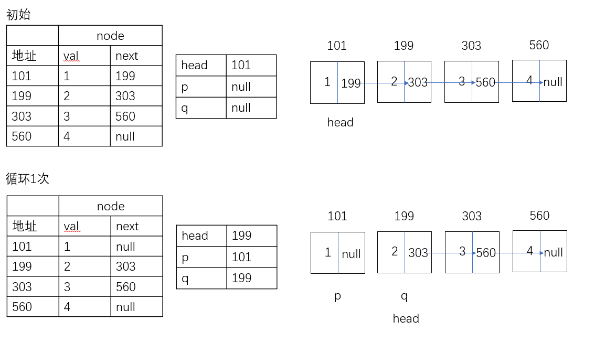
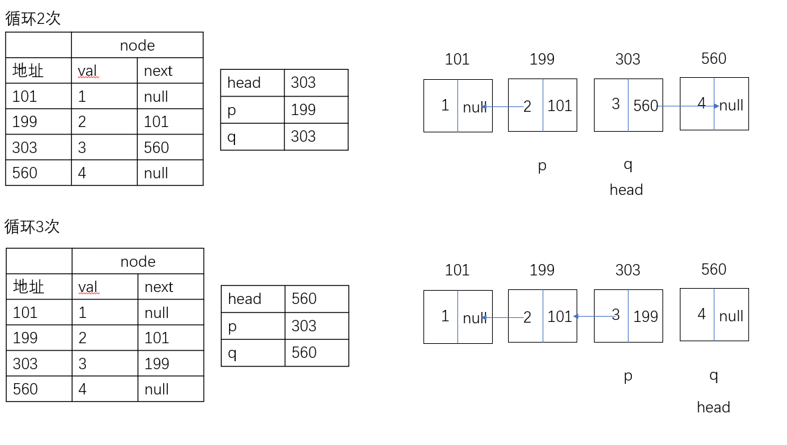
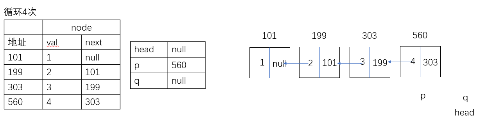

## 题解

#### 方法一
时间复杂度O(n),空间复杂度O(n),但是这样失去了链表的特性。

这道题目相比较于876，优化了循环的判断，判断当前节点是否为空，而非节点的下一个。
```
    var arr = []
    var current = head
    while (current !== null) {
        arr.push(current.val)
        current = current.next
    }
    arr.reverse()
    var i = 0
    current = head
    while (current !== null) {
        current.val = arr[i]
        current = current.next
        i++
    }
    return head
```

#### 方法二
时间复杂度O(n),空间复杂度O(1)，改变指针指向。
```
   var p = null
   var q = null
   while(head !== null){
       q = head.next
       head.next = p
       p = head
       head = q
   }
   return p
```
p用于记录当前节点的前一个节点，q用于记录当前节点的后一个节点。

步骤：
1. 把下一节点的地址存于q
2. 当前节点指向前一个（p中的地址）
3. p存当前节点的地址
4. 当前节点向后移动

举个例子：



