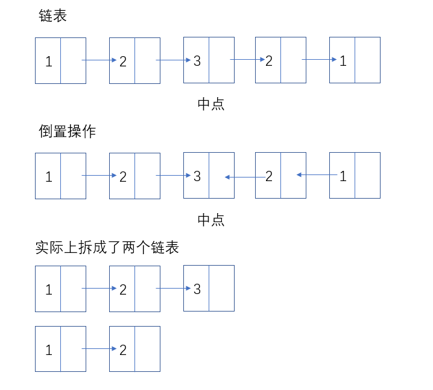

## 题解

这是一道比较综合的题目，综合了链表的找中点、倒置的操作。

解题步骤：
1. 找到链表中点（快慢指针）
2. 中点以后的链表倒置
3. 同时从头和尾遍历链表，比较值


中点之后的链表总是短的，如果短链表指向null了，说明链表已经到了结尾。

```
var isPalindrome = function (head) {
    // 找到中间点
    let slow = head
    let fast = head
    while (fast && fast.next) {
        slow = slow.next
        fast = fast.next.next
    }
    // 翻转后半部分
    let p = null
    let q = null
    while (slow !== null) {
        q = slow.next
        slow.next = p
        p = slow
        slow = q
    }
    // p中保留的就是向前遍历的头结点
    // 比较
    while ( p!== null) {
        if (head.val === p.val){
            head = head.next
            p = p.next
        } else {
            return false
        }
    }
    return true
};
```

